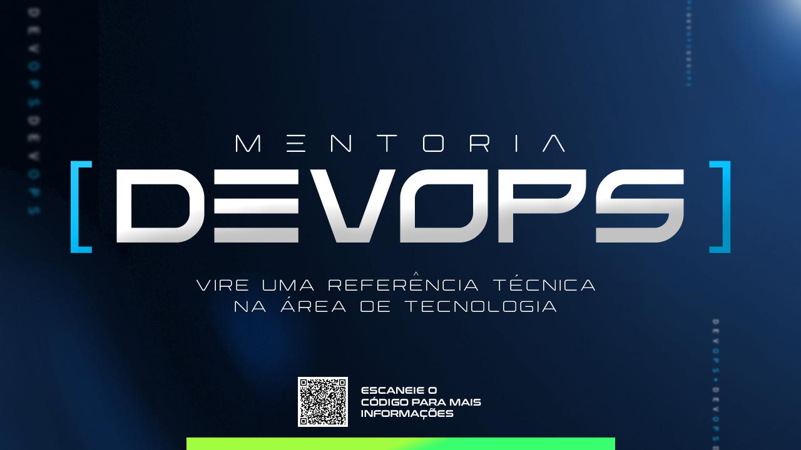

# Mentoria DevOps
Este é o repositório oficial da Mentoria DevOps, uma parceria entre Toolbox e NextWave Educação!

# Nosso objetivo
A Mentoria DevOps é um programa de mentoria de 12 meses com encontros semanais ao vivo, com um grupo seleto e restrito, onde estaremos do seu lado para mantê-lo relevante e atualizado no mercado de tecnologia, aprendendo e implementando as melhores práticas e ferramentas de DevOps.

# Ementa da mentoria
- Git
- Python
- Redes
- Docker
- Kubernetes
- CI/CD
- Jenkins
- Azure DevOps
- GitHub Actions
- Padrões de Deployment
- Infraestrutura como Código (Terraform, Ansible)

# Dinâmica das aulas
- Encontro semanal em grupo:
- Plano personalizado
- Conteúdos exclusivos
- Desafios mensais
- Acompanhamento individualizado

# Público-Alvo
- Programadores que desejam se manter relevantes: Aprendendo e implementando práticas de DevOps para se destacar no mercado;
- Profissionais que já atuam com DevOps: Que querem aprofundar seus conhecimentos e habilidades, mantendo-se atualizados com as melhores práticas;
- Profissionais de Suporte, Cloud, Infra e Redes: Que desejam migrar ou evoluir na área de DevOps e precisam das habilidades necessárias para impulsionar sua carreira.

# Como Participar
Você pode encontrar mais detalhes sobre essa mentoria [clicando aqui](https://bot.fullfunnel.app/formulario-de-aplicacao-mentoria-devops).
